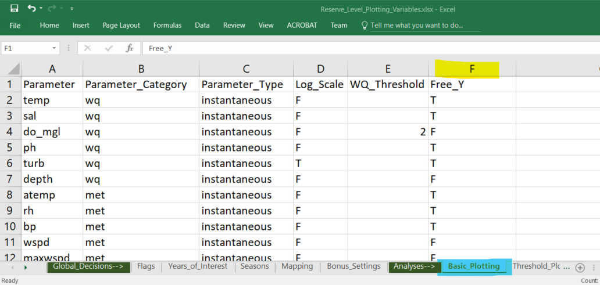
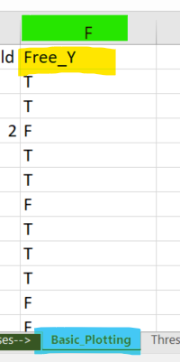

```{r setup, include=FALSE}
knitr::opts_chunk$set(echo = FALSE)
library(SWMPrExtension)
path <- './data'
qaFlags <- c('0', '3', '5')

```

## SWMP Status Report Update

- 2018 data has been processed and all graphics are available at CDMO:
  http://cdmo.baruch.sc.edu/waf/nerrs_swamp_status_reports/
- However, these reports use the old Excel content and R scripts.

That means:

- **Graphs** all scale with 0. as their lowest Y-value.
- **Graphs** all use non-metric units.
- The text and pictures are all from the old, boiler-plate 2016 product.

Graphs, units, and pictures **_may_** need updating, the **text**, at least, **must** be updated.

## SWMP Status Report Update (cont.)

- New version (1.1.2) of SWMPrExtension on CRAN

- New capability to enter flags to auto-scale y-axis

- Bug fixes in Status Report scripts and SWMPrExtension

  - For using metric units
  - With seasonal_dot.R for annotating regression results
  

## Issue: Y-Axis Scale Fixed to 0

```{r scale_problem, warning=FALSE, out.width='55%', fig.align='center' }
df <- import_local(path,'jobjbmet2017')
df <- qaqc(df, qaqc_keep = qaFlags)
raw_boxplot(df, param = 'atemp', plot_title = TRUE, target_yr = '2017', free_y = FALSE)
raw_boxplot(df, param = 'bp', plot_title = TRUE, target_yr = '2017', free_y = FALSE)
```

## Solution: Autoscale Y-Axis

```{r scale_solution, warning=FALSE, out.width='55%', fig.align='center' }
#df <- import_local(path,'jobjbmet2017')
#df <- qaqc(df, qaqc_keep = qaFlags)
raw_boxplot(df, param = 'atemp', plot_title = TRUE, target_yr = '2017', free_y = TRUE)
raw_boxplot(df, param = 'bp', plot_title = TRUE, target_yr = '2017', free_y = TRUE)
```

## How? Flag for `free_y`

- New flag in Excel spreadsheet to specify how y-axis scaling should work,
and the SWMPrExtension package code updated to use the new flag.

```{r rstudio, out.width='95%', fig.align='center'}


```

## The Details

<div style= "float:right; position: relative; top: 0px;">
```{r details, out.width='100%', fig.align='center', out.extra='style="float:right; padding:0px"'}


```
</div>

- Create `Free_Y` entry in column F (the sixth one) on *Basic Plotting* tab of the **Reserve_Level_Plotting_Variables.xlsx** spreadsheet.
  - **T** for **TRUE**: sets lower y-axis bound by the data range.
  - **F** for **FALSE**: sets lower y-axis bound to **0.0**.
  - Set for each variable.
  
- Default is **FALSE**, so that is what you get if you don't add the column at all.

## Note: Previous behaviour was not a problem when data set included negative values

`free_y = TRUE` left, `free_y = FALSE`, right

```{r scale_no_problem, warning=FALSE, out.width='50%', fig.show='hold' }
df <- import_local(path,'lkspomet2018')
df <- qaqc(df, qaqc_keep = qaFlags)
raw_boxplot(df, param = 'atemp', plot_title = TRUE, target_yr = '2018', free_y = TRUE)
raw_boxplot(df, param = 'atemp', plot_title = TRUE, target_yr = '2018', free_y = FALSE)
```

## Other News: Bug fixes

- Fixed font error in `seasonal-dot.R` that stopped the routine that automatically produced all plots in one swell foop. This error was introduced in a recent R update, so you may note have seen it.

- Fixed the conversion to metric units to work for all variables.

## How to get all this goodness?

- Update your SWMPrExtension from the CRAN repo
- Modify your **Reserve_Level_Plotting_Variables.xlsx** to add the `Free_Y` parameter
  - It is in the **figure_files** directory of your status report project.
  - Download an example from https://bit.ly/2NSOqH7
- Download a revised R directory from: 
  - Unzip it and replace the files in the **R** directory of your status report project.
  
Hmmm, I think that is it.  Modify your spreadsheets, and go for it!

All questions to dave.eslinger@noaa.gov.  Thanks!


